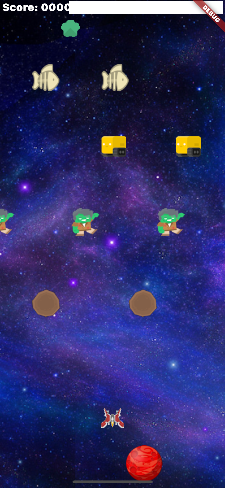
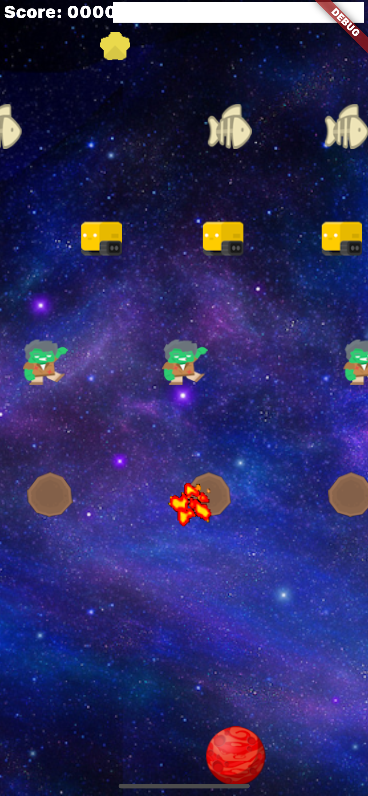
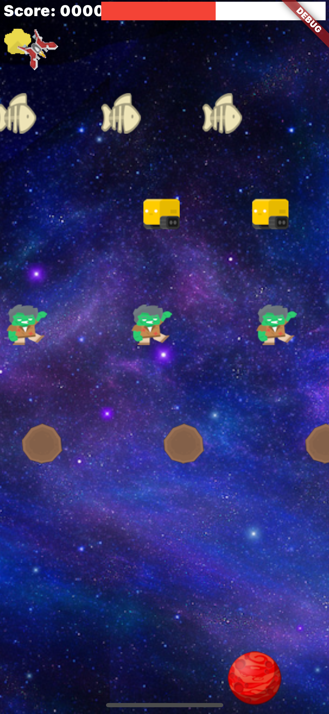
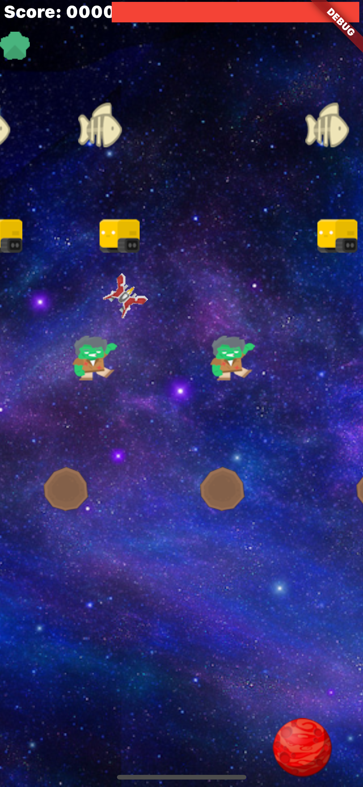
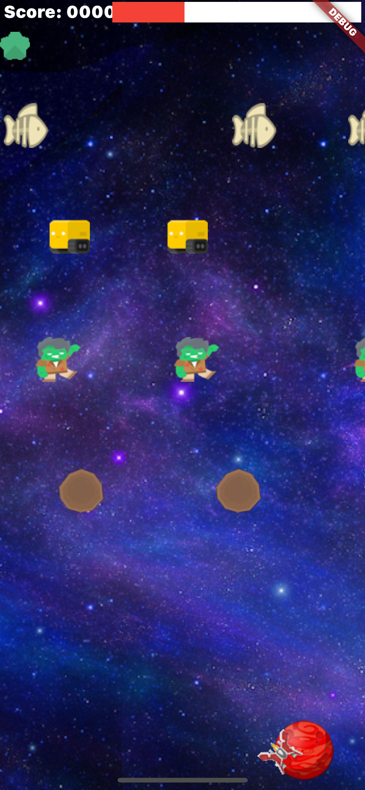
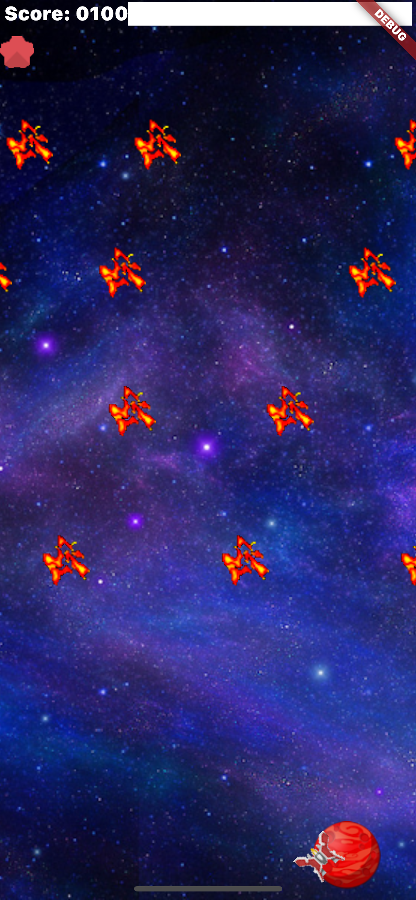

# Flutter Hero
Your ship is located at the bottom of the screen, not far from your home. To operate it, place your finger anywhere on the screen, it will become the anchor point, or zero position of the virtual joystick. Now just slide your finger in any of the eight compass directions and your ship will follow you. Your goal is to go through parasite stripes (_asteroids, aliens, intelligent machines and space fish_). When you reach the top, you touch the crystal and the bar of energy from above will fill up. Then you come back through the parasites, touch your house, the energy is transferred, and at that moment all the parasites explode, and you get a few points. Then the parasites come back and everything repeats again. Of course, you will explode if you touch anything other than the crystal or your house.
___

